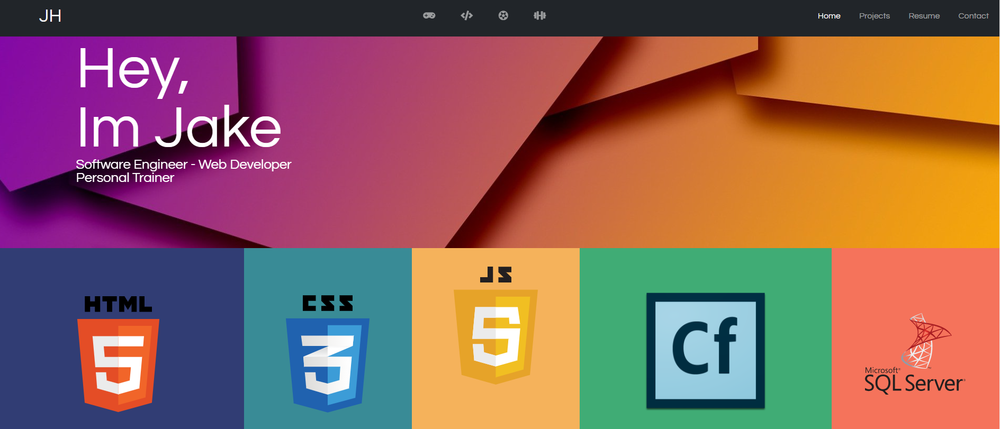

# Jakehohing.github.io

## About This Project

The goal of this project is to build a Personal Portfolio to show off projects and to give a professional description of myself.

This Projects Includes four main pages (Index.html, Portfolio.html, Contact.html, and Resume.html). I Built this portfolio from scratch in an attempt to understand deeper Bootstrap techniques, implement my own Scripting with the help of online forums, and apply advanced CSS styling. My hope is to constantly come back to this project and add new functionality and design techniques as I became familiar with them.

## Built With
- HTML 
- CSS
- Javascript/Jquery

## Contact
project link [https://github.com/jacobhohing/Jakehohing.github.io](https://github.com/jacobhohing/Jakehohing.github.io)
